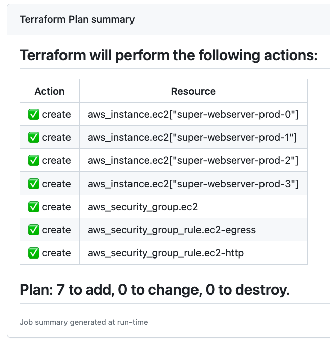

# 04_06_ci_cd_for_infrastructure_as_code
GitHub allows each step in a workflow to send text to the Actions interface using a variable called `GITHUB_STEP_SUMMARY`.

`GITHUB_STEP_SUMMARY` is a variable that contains a path to a file where each step can store text.

If the file contains any text at the end of a step’s run, the text is written to the workflow summary and styled as Github Flavored Markdown.  Along with Markdown, we can also use emojis to add extra flair to the step summary.

## Example use of `GITHUB_STEP_SUMMARY`
```
- name: Terraform Plan
continue-on-error: true
id: plan
run: |
    terraform plan -input=false -no-color -out=tfplan
    terraform show -no-color tfplan > plan.txt


- name: Display the plan summary
id: display
run: |
    {
    awk '/No changes. Your infrastructure matches the configuration./ {
        print "## " $0
        print "Terraform has compared your real infrastructure against your configuration and found no differences, so no changes are needed."
        exit
    }' plan.txt

    awk '/Terraform will perform the following actions:/ {
        print "## Terraform will perform the following actions:"
        print "|Action|Resource|"
        print "|------|--------|"
        exit
    }' plan.txt

    awk '/Terraform used the selected/{ next } /will be/ || /must be/ {print "|" $5 "|" $2 "|"; next} /Plan:/{ print "## " $0; next }' plan.txt \
        | sed -e 's/created/:white_check_mark: create/' -e 's/destroyed/:bangbang: destroy/' -e 's/replaced/:recycle: replace/'
    } > plan.md
    cat plan.md >> $GITHUB_STEP_SUMMARY
```

Using the Terraform configuration provided, this produces the following output on the initial plan:



## Recommended Reading
- [Adding a job summary with $GITHUB_STEP_SUMMARY](https://docs.github.com/en/actions/using-workflows/workflow-commands-for-github-actions#adding-a-job-summary)

- [GitHub Markdown - Basic writing and formatting syntax](https://docs.github.com/en/get-started/writing-on-github/getting-started-with-writing-and-formatting-on-github/basic-writing-and-formatting-syntax)

- [GitHub Markdown - Emoji-Cheat-Sheet](https://github.com/ikatyang/emoji-cheat-sheet/blob/master/README.md)

- [LinkedIn Learning - Learning Terraform](https://www.linkedin.com/learning/learning-terraform-15575129/learn-terraform-for-your-cloud-infrastructure)

- [Running Terraform in Automation](https://developer.hashicorp.com/terraform/tutorials/automation/automate-terraform)

# Using the Exercise Files
## 1. Add permissions to your service account; Create an S3 bucket
1. _For details on creating or updating a service account, see the [instructions in lesson 04_04](../04_04_create_a_service_account/README.md)._

    Add the following permission to the service account you will use for this exercise:

        AmazonS3FullAccess

1. Create an S3 bucket to use for storing Terraform state files.

    1. Go to the [S3 homepage](s3.console.aws.amazon.com).
    1. Select `Create bucket`.
    1. Give your bucket a name.  The bucket name must be globally unique and must not contain spaces or uppercase letters. [See rules for bucket naming](https://docs.aws.amazon.com/AmazonS3/latest/userguide/bucketnamingrules.html).
    1. Confirm the region for the bucket.  It should be the same region you will use to configure your service account in the repository.
    1. Keep all defaults and select `Create bucket` at the bottom of the form.
    1. Make a note of your bucket name. Make a note of the region where you created the bucket.

## 2. Add and update the exercise files
1. Create a new repo and add the exercise files for this lesson.
1. Move the workflow files into `.github/workflows`:

    - [terraform-pipeline.yml](./terraform-pipeline.yml)
    - [destroy-resources.yml](./destroy-resources.yml)

1. Update the terraform configuration to match your AWS account settings.

    1. Edit [terraform.tf](./terraform.tf).  Update the `bucket` and `region` assignments so that they match the bucket and region you used in the previous steps.

            terraform {
                required_version = "~> 1.4"

                backend "s3" {
                    key    = "github-actions-cicd/terraform.tfstate"
                    bucket = "ADD_YOUR_BUCKET_NAME_HERE" # the bucket
                    region = "ADD_YOUR_REGION_NAME_HERE" # the region
                }
            }

## 3. Configure service account credentials; Configure branch and environment protection rules
1. Configure the service account credentials.

    1. Select `Settings` -> `Secrets and variables` -> `Actions`.
    1. Select `New respository secret`.
    1. Create entries for the following using the values retrieved when you created the service account.
        - `AWS_ACCESS_KEY_ID`
        - `AWS_SECRET_ACCESS_KEY`
        - `AWS_ACCOUNT_NUMBER`
    1. Select the `Variables` tab.
    1. Select `New repository variable`.
    1. Create an entry for `AWS_REGION` using the same region as the bucket created in previous steps.

1. Create a branch protection rule.

    1. Select `Settings` -> `Branches` -> `Add branch protection rule`.
    1. Under "Branch name pattern" enter: `main`.
    1. Under "Protect matching branches":
        - Select `Require a pull request before merging`.
        - Un-select `Require approvals`.  (This is because you can't approve your own merge requests.  Keeping this option selected would require you to override the merge protection on each pull request.)
        - Select `Require status checks to pass before merging`.
        - At the bottom of the page, select `Create`.

1. Create an environment protection rule.

    1. Select `Settings` -> `Environments` -> `New environment`.
    1. For the name, enter `Production`.  Select `Configure environment`.
    1. Select `Required reviewers`.
    1. In the search field, enter your GitHub user name and select it.
    1. Select `Save protection rules`.

## 4. Edit the Terraform configuration and create a pull request (PR)
1. Edit the file [`variables.tf`](./variables.tf).
1. Find the `server_count` code block at the top of the file.

        variable "server_count" {
            type        = number
            default     = 3
            description = "The total number of VMs to create"
        }

    Change `default = 3` -> `default = 4`.

1. Select `Commit changes`.
1. Select `Create a new branch for this commit and start a pull request`.  Then select, `Propose changes`.
1. Select `Create pull request`.
1. Observe the checks and summaries from  GitHub Actions being written to the pull request.  Wait for the workflow to complete.
1. Select `Merge pull request` -> `Confirm merge`.
1. Go to the `Actions` tab.  Select the most recent running workflow.
1. Observe the pipeline's progress and note the updates to the workflow summary.
1. When prompted, select `Review deployments`.
1. Select `Production` -> `Approve and deploy`.
1. Observe the pipeline's progress and note the updates to the workflow summary.
1. Follow the links in the workflow summary to view the e-commerce site deployed by the workflow.

## 5. Remove the resources
**To avoid costs associated with running resources in AWS, please remove them by running the `99-Destroy Resources` workflow.**

1. Select the `Actions` tab.
1. Select the workflow `99-Destroy Resources`.
1. Next to "This workflow has a workflow_dispatch event trigger.", Select `Run workflow` -> `Run workflow`.
1. Select the running workflow. Observe the pipeline's progress and note the updates to the workflow summary.
1. When prompted, select `Review deployments`.
1. Select `Production` -> `Approve and deploy`.
1. Observe the pipeline's progress and note the updates to the workflow summary.