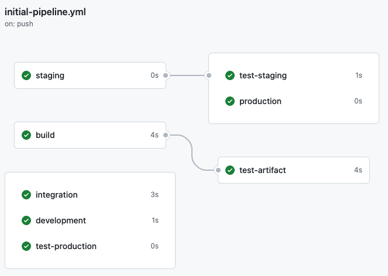
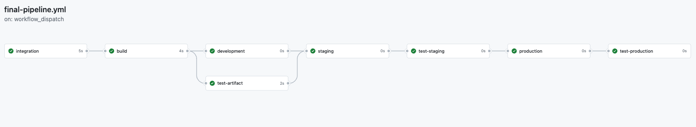

# 04_08_solution_develop_a_deployment_pipeline
It's time for a challenge!

Your team is excited to use GitHub Actions for their next project.

The goal is to develop a model pipeline that provides continuous integration, continuous delivery, and continuous deployment to three different environments.

However, things aren’t lining up.

To start, the workflow jobs are being run in the wrong order.  And while some of the environments will use continuous deployment, others will need to be reviewed before they can be deployed.

They’ve asked you to help them straighten out the pipeline, set up more control for deployment to particular environments, and provide a summary once the pipeline completes.

# Solution
1. Create a new repo and add the exercise files. Run and observe the provided workflow.

    Move the provided workflow into the `.github/workflows` directory.

    The provided workflow has `push` and `workflow_dispatch` triggers.  Adding the workflow should start a run.

    The initial workflow should appear similar to the following:

    

1. Edit the workflow to place the jobs in order.

   The provided workflow, [initial-pipeline.yml](./initial-pipeline.yml), has some order to it but the jobs are not configured properly to run in sequence.

   Place the jobs in order by adding the `needs` keyword to each job, followed by the correct job.

        build:
            needs: [integration]

        ...

        test-artifact:
            needs: [build]

        ...

        development:
            # Note this job may also depend on `test-artifact`
            needs: [build]

        ...

        staging:
            # Note this stage may also depend on `development`
            needs: [development, test-artifact]

        ...

        test-staging:
            needs: [staging]

        ...

        production:
            needs: [test-staging]

        ...

        test-production:
            needs: [production]

1. Configure the following environments:

    - Development
    - Staging
    - Production

    These environments can be created from the workflow or from the repository settings.  If they are created in the repository settings, the workflow will still need to be updated to connect them to the associated job.

    When the environments are in place, the workflow should include:

        development:
            environment: Development

        ...

        staging:
            environment: Staging

        ...

        production:
            environment: Production

1. Use continuous deployment for the Development and Staging environments.

    If the `development` and `staging` jobs are in the correct order and configured with `needs` as previously mentioned, this requirement should be satisfied.

1. Protect deployments to the Production environment with a review.

    1. Select `Settings` -> `Environments` -> `production`.
    1. Select the checkbox next to `Required reviewers`.
    1. Search for your user name in the field labeled `Add up to 5 or more reviewers`.
    1. Select `Save protection rules`.
    1. Run the workflow using the `workflow_dispatch` trigger to confirm the `production` environment prompts for a review before running.

1. Update the summary to indicate all jobs have completed successfully.

    Modify the last step in the `test-production` job so that the `echo` is directed to `>> $GITHUB_STEP_SUMMARY`:

        test-production:
            ...
            - run: echo "# Everything completed successfully!" >> $GITHUB_STEP_SUMMARY

## The Updated Workflow
One solution for this challenge is in [final-pipeline.yml](./final-pipeline.yml)

